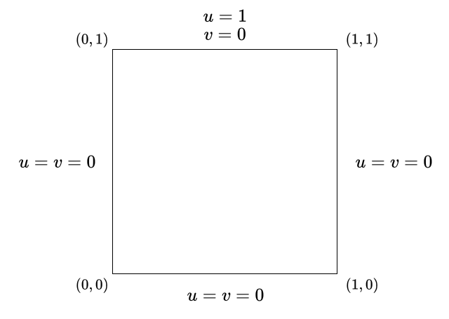
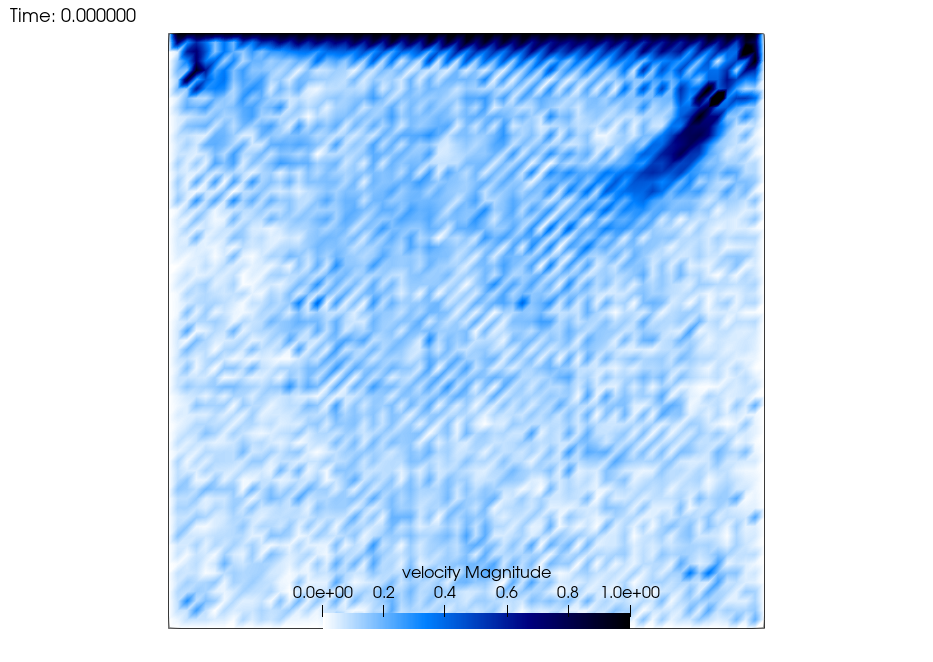
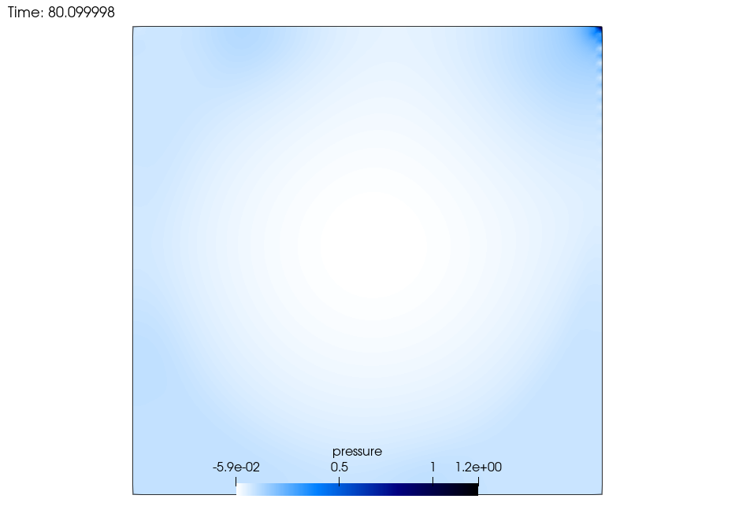

# Mathematics and such
In a nutshell, saNSs is a fully implicit solver for the time-dependent Navier-Stokes equations with Galerkin Least Squares stabilisation.

## The governing equations
The Navier-Stokes equations for an incompressible fluid can be written in strong form as

$$
\begin{split}
\frac{\partial \boldsymbol{u}}{\partial t} + \boldsymbol{u}\cdot \nabla \boldsymbol{u} + \nabla p - \nu \Delta \boldsymbol{u} &= 0 \quad \text{in }\Omega,\\
\nabla \cdot \boldsymbol{u} &= 0 \quad \text{in }\Omega,
\end{split}
$$

where $\nu$ is the kinematic viscosity and $p$ is the kinematic pressure. As per usual, these equations need to be complemented with initial and boundary conditions.

Given the strong form, the *weak* form of the governing equations is found by testing the first equation with $\boldsymbol{v}\in V$ and the second equation with $q \in Q$, where $V$ and $Q$ are appropriate spaces that guarantee the inf-sup stability of the problem. The weak form reads

$$
\begin{split}
\int_\Omega \frac{\partial \boldsymbol{u}}{\partial t} \cdot \boldsymbol{v} 
    + \int_\Omega (\boldsymbol{u}\cdot \nabla \boldsymbol{u})\cdot \boldsymbol{v} 
    - \int_\Omega p\nabla \cdot \boldsymbol{v}
    + \int_\Omega \nu \nabla \boldsymbol{u} : \nabla \boldsymbol{v} 
     &= \int_{\partial\Omega} \boldsymbol{v} \cdot (-p \mathbb{I} + \nu \nabla \boldsymbol{u}) \cdot \boldsymbol{n} \quad \forall v \in V,\\
\int_\Omega q \nabla \cdot \boldsymbol{u} &= 0 \quad \forall q \in Q.
\end{split}
$$

Here we shall consider Dirichlet boundary conditions for the velocity, so that an appropriate choice for $V$ is $V = [H^1_0(\Omega)]^d$, and the boundary integral vanishes. Also, with this choice of boundary conditions, pressure will be defined up to a constant and so we shall choose $Q = L^2_0(\Omega)$, i.e. the space of square-integrable functions with zero mean.

## Discretised equations
The well posedness of the continuos problem does not guarantee well posedness of the discrete problem, where we approximate the original spaces with $V_h$ and $Q_h$. For example, if we were to choose $V = \mathbb Q^1$ and $Q = \mathbb Q^1$, the discrete inf-sup conditions would not be satisfied, and thus the discrete problem would be unstable. 

At this point we could simply choose different spaces, and indeed the pair $\mathbb Q^{k+1}-\mathbb Q^k$ for $k \geq 1$ would work just fine, or we could go the extra mile and stabilise the equations instead.

### Galerkin Least Squares
One of the possible stabilisations is the *Galerkin Least Squares* formulation. The idea here is to add to the original formulation an extra term given by the residual of the strong form, tested with the strong differential operator applied to test functions. This yields a formulation that not only is consistent (as the residual of the exact solution is zero), but also allows for the use of equal-degree elements, regularises the solution in convection-dominated flows, and introduces a coupling of pressure degrees of freedom with themselves, effectively getting rid of the zero block in the system matrix of the non-stabilised problem.

The weak form then reads

$$
\begin{split}
&\int_\Omega \frac{\partial \boldsymbol{u}}{\partial t} \cdot \boldsymbol{v} 
    + \int_\Omega (\boldsymbol{u}\cdot \nabla \boldsymbol{u})\cdot \boldsymbol{v} 
    - \int_\Omega p\nabla \cdot \boldsymbol{v}
    + \int_\Omega \nu \nabla \boldsymbol{u} : \nabla \boldsymbol{v} + \int_\Omega q \nabla \cdot \boldsymbol{u} \\
    &+ \sum_\mathcal{T} \int_\mathcal{T} \tau_{GLS} \left ( \frac{\partial \boldsymbol{u}}{\partial t} + \boldsymbol{u} \cdot \nabla \boldsymbol{u} + \nabla p - \nu \Delta \boldsymbol{u} \right)\cdot \left (\boldsymbol{u} \cdot \nabla \boldsymbol{v} + \nabla q - \nu \Delta \boldsymbol{v} \right) \\
     & + \sum_\mathcal{T} \int_\mathcal{T} \tau_{LSIC} \nabla \cdot \boldsymbol{u} \; \nabla \cdot \boldsymbol{v} = 0, \\
\end{split}
$$

where $\mathcal T$ is an element of the triangulation, and $\tau_{GLS}$ and $\tau_{LSIC}$ are coefficients that need to be specified in order to provide an appropriate amount of stabilisation. As it turns out, a good choice for these parameters is

$$
\begin{split}
\tau_{GLS} &= \left [ \frac{1}{\Delta t ^2} + \left( \frac{2~|\boldsymbol{u}|}{h}\right )^2 + 9\left( \frac{4~\nu}{h^2}\right )^2 \right ]^{-1/2}, \\
\tau_{LSIC} &= \frac{|\boldsymbol u|~ h}{2},
\end{split}
$$

with $\Delta t$ the time step and $h$ a characteristic size of the element. Following what is done in [Lethe](https://github.com/chaos-polymtl/lethe), $h$ is chosen to be the diameter of a sphere having the same volume as the element.


### Time discretisation
Here we shall not employ space-time discretisations, but rather we will use an implicit Euler scheme. With this choice of time discretisation, the weak form becomes

$$
\begin{split}
&\int_\Omega \frac{\boldsymbol{u}^{n+1}-\boldsymbol{u}^n}{\Delta t} \cdot \boldsymbol{v} 
    + \int_\Omega (\boldsymbol{u}^{n+1}\cdot \nabla \boldsymbol{u}^{n+1})\cdot \boldsymbol{v} 
    - \int_\Omega p^{n+1}\nabla \cdot \boldsymbol{v}
    + \int_\Omega \nu \nabla \boldsymbol{u}^{n+1} : \nabla \boldsymbol{v} + \int_\Omega q \nabla \cdot \boldsymbol{u}^{n+1} \\
    &+ \sum_\mathcal{T} \int_\mathcal{T} \tau_{GLS} \left ( \frac{\boldsymbol{u}^{n+1}-\boldsymbol{u}^n}{\Delta t} + \boldsymbol{u}^{n+1} \cdot \nabla \boldsymbol{u}^{n+1} + \nabla p^{n+1} - \nu \Delta \boldsymbol{u}^{n+1} \right)\cdot \left (\boldsymbol{u}^{n+1} \cdot \nabla \boldsymbol{v} + \nabla q - \nu \Delta \boldsymbol{v} \right) \\
     & + \sum_\mathcal{T} \int_\mathcal{T} \tau_{LSIC} \nabla \cdot \boldsymbol{u}^{n+1} \; \nabla \cdot \boldsymbol{v} = 0. \\
\end{split}
$$

Here we assume that the solution at time $t_n$ is known ( for $n=0$ it will be the initial condition ), and so the challenge is to solve a nonlinear system of equations for the unknowns $(\boldsymbol u^{n+1}, p^{n+1})$. 

## Nonlinear solver
Provided that we can come up with a good initial guess of what the solution should be -- and we are willing to do a bit of calculations -- a good choice is to go with Newton's method, which should quickly converge to the right solution. Indeed, since we are dealing with time dependent problems, we could just use the solution at time $t_n$ as initial guess for the solution at time $t_{n+1}$, so we should be good to go.

Now that we have a good initial guess, all that is left is to refine the solution until we are satisfied with it. In other words, given the guess $(\boldsymbol u_0, p_0)$, at each iteration of the method we compute 

$$
\boldsymbol u_{k+1} = \boldsymbol u_k + \delta \boldsymbol u, \quad p_{k+1} = p_{k} + \delta p,
$$

where $(\delta \boldsymbol u, \delta p)$ are found by solving the linear system

$$
J_{\boldsymbol u_k, p_k} (\delta\boldsymbol u, \delta p) = -\mathcal F(\boldsymbol u_k, p_k).
$$

In this expression, $\mathcal F$ is the nonlinear operator we are dealing with, i.e. the discretised weak form of our equation, and $J$ is its Jacobian, which in our case is the Gateaux derivative of the governing equations. With a bit of care and a lot of patience we find that the Jacobian is given by

```math
\begin{split}
&\int_\Omega \frac{\delta \boldsymbol{u}}{\Delta t} \cdot \boldsymbol{v} 
    + \int_\Omega ( \delta \boldsymbol{u}\cdot \nabla \boldsymbol{u}_k + \boldsymbol{u}_k \cdot \nabla \delta \boldsymbol{u}) \cdot \boldsymbol{v} 
    - \int_\Omega \delta p\nabla \cdot \boldsymbol{v}
    + \int_\Omega \nu \nabla \delta \boldsymbol{u} : \nabla \boldsymbol{v} + \int_\Omega q \nabla \cdot \delta \boldsymbol{u} \\
    &+ \sum_\mathcal{T} \int_\mathcal{T} \tau_{GLS} \left ( \frac{\delta \boldsymbol{u}}{\Delta t} + \delta \boldsymbol{u}\cdot \nabla \boldsymbol{u}_k + \boldsymbol{u}_k \cdot \nabla \delta \boldsymbol{u} + \nabla \delta p - \nu \Delta \delta \boldsymbol{u} \right)\cdot \left (\boldsymbol{u}_k \cdot \nabla \boldsymbol{v} + \nabla q - \nu \Delta \boldsymbol{v} \right) \\
    &+ \sum_\mathcal{T} \int_\mathcal{T} \tau_{GLS} \left ( \frac{\boldsymbol{u}_k -\boldsymbol{u}^n}{\Delta t} + \boldsymbol{u}_k \cdot \nabla \boldsymbol{u}_k + \nabla p_k - \nu \Delta \boldsymbol{u}_k \right)\cdot \left (\delta \boldsymbol{u} \cdot \nabla \boldsymbol{v} \right) \\
     & + \sum_\mathcal{T} \int_\mathcal{T} \tau_{LSIC} \nabla \cdot \delta \boldsymbol{u} \; \nabla \cdot \boldsymbol{v} = 0 . \\
\end{split}
```

At each Newton iteration then we assemble the Jacobian and right-hand side, we solve the linear system for the update vectors and finally update the solution. This process is repeated until the norm of the residual falls below a predefined threshold, at which point we can move on to the next time step.

In practice, solving the linear system at each Newton iteration is no easy task, since the system matrix is non-symmetric and possibly ill-conditioned. Here we shall use an iterative linear solver, GMRES, with an AMG preconditioner. 

Also, it should be noted that in deriving the Jacobian, the derivatives of $\tau_{GLS}$ and $\tau_{LSIC}$ were not taken into account. This does not seem to affect the convergence of the method.

## Test case
We shall test the solver by simulating the 2-dimensional lid-driven cavity, and comparing the results with those by [Ghia et al. (1982)](https://www.sciencedirect.com/science/article/pii/0021999182900584). 

The setup is quite simple: the domain is the square $[0, 1]\times[0,1]$, and we impose homogeneous Dirichlet boundary conditions on all sides but the top one, where instead we impose a constant velocity along the $x$ direction of magnitude $1~m/s$. As anticipated, we shall constrain the pressure to have zero mean over the domain. Here is a sketch of the domain.


We shall perform simulations for different values of the Reynolds number $Re = \frac{U\; L}{\nu}$ and compare stabilised equal-order solutions with non-stabilised solutions. We let the system evolve until a steady state is reached, and compare the velocity profile with that by [Ghia et al. (1982)](https://www.sciencedirect.com/science/article/pii/0021999182900584). Note that since the geometry is fixed and the top velocity is fixed, then for all cases we have $U=1\;m/s, L = 1\;m$, so we get different $Re$ by setting $\nu = 1/Re$.


## Commented program
#### TimeControl class
We write a class that is responsible for controlling the time. It stores information about the initial and final times, the increment $\Delta t$, the number of the current time step and, most importantly, whether the simulation is steady or not.
```c++
class TimeControl
{
public:
	TimeControl();
	void advance_time();
	void set_dt(const double);
	double get_dt();
	double get_current_time();
	double get_initial_time();
	double get_final_time();
	unsigned int get_current_time_step();

	bool is_steady;

	void declare_parameters(ParameterHandler &);
	void read_parameters(ParameterHandler &);
private:
	double initial_time;
	double final_time;
	double t;
	double dt;
	unsigned int time_step;
};
```
##### TimeControl::TimeControl 
The constructor of this class simply initialises the attributes. These will be overwritten later after reading parameters from file.
```c++
TimeControl::TimeControl()
	: is_steady(false)
	, initial_time(0.)
	, final_time(1.)
	, t(0.)
	, dt(0.01)
	, time_step(0)
{}
```
##### TimeControl getters and setters
Nothing strange going on here, just functions to set and get certain attributes.
```c++
void TimeControl::advance_time()
{
	this->t += this->dt;
	this->time_step++;
}

void TimeControl::set_dt(const double new_dt)
{
	this->dt = new_dt;
}

double TimeControl::get_dt()
{
	return this->dt;
}

double TimeControl::get_current_time()
{
	return this->t;
}

double TimeControl::get_initial_time()
{
	return this->initial_time;
}

double TimeControl::get_final_time()
{
	return this->final_time;
}

unsigned int TimeControl::get_current_time_step()
{
	return this->time_step;
}
```
##### TimeControl::declare_parameters and TimeControl::read_parameters
These functions are needed for the user to be able to specify some simulation parameters in a `.prm` file. The functions take a `ParameterHandler` in input as `TimeControl` will be a member of the `NavierStokes` class, which will own the `ParameterHandler` responsible for handling all paramters ( not just time related ).
```c++
void TimeControl::declare_parameters(ParameterHandler &prm)
{
    prm.enter_subsection("Time parameters");
    prm.declare_entry("Initial time",
                      "0.",
                      Patterns::Double(0.),
                      "Initial time for the simulation.");
    prm.declare_entry("Final time",
                      "1.",
                      Patterns::Double(0.),
                      "Final time for the simulation.");
    prm.declare_entry("Delta t",
                      "0.01",
                      Patterns::Double(0.),
                      "Size of the time step.");
    prm.declare_entry("Is steady",
		      "false",
		      Patterns::Bool(),
                      "Whether the simulation is steady or not.");
    prm.leave_subsection();
}

void TimeControl::read_parameters(ParameterHandler &prm)
{
    prm.enter_subsection("Time parameters");
    initial_time = prm.get_double("Initial time");
    t = initial_time;
    final_time = prm.get_double("Final time");
    dt = prm.get_double("Delta t");
    is_steady = prm.get_bool("Is steady");
    prm.leave_subsection();
}
```

#### makeCavity function
A utility function that defines the computational domain and boundary conditions for the lid-driven cavity flow. It is templated on the spatial dimension, although at the moment only the 2D case is implemented, since this is what we are interested in. Internally it simply makes use of the `GridGenerator::hyper_cube` function from deal.ii to build a triangulation on a square domain with a given level of refinement, then it populates a map that will be used by the `NavierStokes` class to build `AffineConstraints` objects. The boundary ids are described in deal.ii's documentation.
```c++
template <int dim>
void makeCavity(parallel::distributed::Triangulation<dim> &tria, 
	    	std::map<types::boundary_id, std::shared_ptr<Function<dim>> > &boundary_conditions,
		const unsigned int n_refinements = 6)
{
    Assert((dim == 2), ExcNotImplemented());
    GridGenerator::hyper_cube(tria, 0., 1., true);
    tria.refine_global(n_refinements);

    boundary_conditions.insert({0, std::make_shared<Functions::ZeroFunction<dim>>(dim+1)});
    boundary_conditions.insert({1, std::make_shared<Functions::ZeroFunction<dim>>(dim+1)});
    boundary_conditions.insert({2, std::make_shared<Functions::ZeroFunction<dim>>(dim+1)});
    boundary_conditions.insert({3, std::make_shared<CavityInlet<dim>>()});
}
```
#### CavityInlet class
This class inherits from deal.ii `Function` and simply defines the boundary conditions for the cavity problem. Note that in principle this is a `dim+1`-valued function, since the solution to our problem has `dim` components for velocity `+1` for pressure. In practice we do not want to impose Dirichlet conditions to pressure, so we will make use of a `ComponentMask` later on.
```c++
template <int dim>
class CavityInlet: public Function<dim>
{
public: 
    CavityInlet() : Function<dim>(dim+1) {}

    virtual double value(const Point<dim> &p, const unsigned int component) const override;
};

template <int dim>
double CavityInlet<dim>::value(const Point<dim> &p, const unsigned int component) const
{
    if (component == 0 && std::abs(p[1]-1) < 1e-10)
	return 1;
    return 0.;
}
```
#### LinearSolverType, StabilisationType, TestCase enums
These come in handy if we want to control some more details of the solver from a parameter file.

`LinearSolverType` determines which linear solver should be used.
```c++
enum class LinearSolverType
{
    direct,
    gmres
};
```
`StabilisationType` determines whether the GLS stabilisation terms should be used in assembly.
```c++
enum class StabilisationType
{
    none,
    gls
};
```
`TestCase` is used to select one of three predefined test cases to run. Here we will use `cavity`.
```c++
enum class TestCase
{
    cavity,
    cylinder,
    channel
};

```

#### NavierStokes class
This is the class that implements the actual physics. All that we discussed above about stabilisation, Newton's method and linear solver happens here.

The only public members are the constructor, which accepts the name of a `.prm` file, and the `solve` method, which performs the time evolution of the system, with all the necessary steps.
```c++
template <int dim>
class NavierStokes
{
public:
	NavierStokes(const std::string);
	void solve();
```
This class also has methods needed to read parameters from file. In addition to those, it also owns the `ParameterHandler`.
```c++
private:
	ParameterHandler prm;
	void declare_parameters();
	void read_parameters(const std::string fname);
```
This is pretty standard stuff. Notice that we employ an `FESystem` since we are dealing with vector-valued, mixed problems.
```c++
	unsigned int	    degree_u;
	unsigned int	    degree_p;
	std::shared_ptr<FESystem<dim>>  fe;
	DoFHandler<dim>	    dof_handler;
	parallel::distributed::Triangulation<dim>	triangulation;
	unsigned int    degree_q;
	QGauss<dim>     quadrature_cells;
```
Here it is important to notice that we have two `AffineConstraints` objects. Both of these are used to impose Dirichlet boundary conditions on the same boundaries, with the difference that `zero_contraints` will *always* impose homogeneous conditions, while `nonzero_constraints` will impose the physical boundary conditions. In particular, the former is needed to impose homogeneous boundary conditions to $\delta \boldsymbol u$ in Newton iterations. Indeed, if $\boldsymbol u_k$ already satisfies the correct boundary conditions, in order for $\boldsymbol u_{k+1}$ to also satisfy the correct conditions we need $\delta \boldsymbol u$ to vanish on the boundary.
```c++
	std::map<types::boundary_id, std::shared_ptr<Function<dim>>>	boundary_conditions;
	AffineConstraints<double>	zero_constraints;
	AffineConstraints<double>	nonzero_constraints;
	bool	pressure_has_zero_mean;
	void	make_constraints();
	void	pressure_mean_to_zero();

	TestCase    test_case;
	unsigned int    n_refinements;
	TimeControl     time_control;
	double			nu;
	StabilisationType	stabilisation;


	void	setup_system();
	void	assemble(const bool, const bool);
	void	assemble_system(const bool);
	void	assemble_rhs(const bool);

	void 	solve_newton(bool);
	void	solve_linear_system();

	unsigned int max_nonlinear_iterations;
	unsigned int max_linear_iterations;
	double nonlinear_tolerance;
	double linear_tolerance;
	LinearSolverType linear_method;
```
We will use Trilinos to parallelise the code in distributed memory. Notice that we use `Vector` and `SparseMatrix` and not `BlockVector` and `BlockSparseMatrix`. The reason is that Trilinos sometimes complains if you try to use block vectors or matrices, and since we are trying to solve the whole system simultaneously in a monolithic way, we won't really make use of the block structure anyway.
```c++
	TrilinosWrappers::MPI::Vector	solution_nm1;
	TrilinosWrappers::MPI::Vector	solution;
	TrilinosWrappers::MPI::Vector	newton_update;

	SparsityPattern			sparsity_pattern;
	TrilinosWrappers::SparseMatrix	system_matrix;
	TrilinosWrappers::MPI::Vector	system_rhs;

	MPI_Comm	mpi_communicator;
	int		mpi_rank;

	IndexSet	locally_owned_dofs;
	IndexSet	locally_relevant_dofs;
```
Finally some utilities for logging, postprocessing and output. For this test case we won't really need the postprocessing tools.
```c++
	ConditionalOStream	pcout;
	std::string output_directory;
	unsigned int write_interval;
	bool   compute_strain_rate;
	bool   compute_vorticity;

	void	output_results(TimeControl &);

};
```

##### NavierStokes::NavierStokes
We start by initialising some variables and reading parameters from file.
```c++
template <int dim>
NavierStokes<dim>::NavierStokes(const std::string fname)
    : degree_u(1)
    , degree_p(1)
    , triangulation(MPI_COMM_WORLD)
    , degree_q(degree_u + 2)
    , quadrature_cells(degree_u + 2)
    , max_nonlinear_iterations(10)
    , max_linear_iterations(100)
    , nonlinear_tolerance(1e-6)
    , linear_tolerance(1e-6)
    , mpi_communicator(MPI_COMM_WORLD)
    , mpi_rank(Utilities::MPI::this_mpi_process(mpi_communicator))
    , pcout(std::cout, (mpi_rank == 0))
    , output_directory("simulation_output")
    , compute_strain_rate(false)
    , compute_vorticity(false)
{
    declare_parameters();
    read_parameters(fname);
```
Once the parameters are all set, we initialise the `FESystem` with the correct polynomial degrees, setup the mesh and initialise the `DoFHandler`.
```c++
    fe = std::make_shared<FESystem<dim>>(FE_Q<dim>(degree_u), dim, FE_Q<dim>(degree_p), 1);

    if (test_case == TestCase::cavity)
	makeCavity(triangulation, boundary_conditions, n_refinements);
    else if (test_case == TestCase::cylinder)
	makeCylinder(triangulation, boundary_conditions, n_refinements);
    else if (test_case == TestCase::channel)
	makeChannel(triangulation, boundary_conditions, n_refinements);

    dof_handler.clear();
    dof_handler.reinit(triangulation);
}
```
##### NavierStokes::declare_parameters and NavierStokes::read_parameters
Initialise the `ParameterHandler` with all the necessary entries and read the values from file. These methods call the corresponding methods in `TimeControl`.
```c++
template <int dim>
void NavierStokes<dim>::declare_parameters()
{
    time_control.declare_parameters(prm);

    prm.enter_subsection("Geometry");
    prm.declare_entry("Test case",
		      "cavity",
		      Patterns::Selection("cavity|cylinder|channel"),
		      "Predefined test case to run. Either `cavity` for the lid-driven cavity flow, `cylinder` for the 2D flow past a cylinder, or `channel` for a 2D plane channel flow.");
    prm.declare_entry("Number of refinements",
		      "1",
		      Patterns::Integer(1),
		      "How many times should the mesh be refined.");
    prm.leave_subsection();

    prm.enter_subsection("Governing equations");
    prm.declare_entry("Kinematic viscosity",
		      "0.01",
		      Patterns::Double(0.0),
		      "Kinematic viscosity.");
    prm.declare_entry("Stabilisation",
		      "gls",
		      Patterns::Selection("none|gls"),
		      "What kind of stabilisation should be used. Either `none` or `gls`.");
    prm.leave_subsection();

    prm.enter_subsection("Finite Element");
    prm.declare_entry("u degree",
		      "1",
		      Patterns::Integer(1),
		      "Polynomial degree for velocity.");
    prm.declare_entry("p degree",
		      "1",
		      Patterns::Integer(1),
		      "Polynomial degree for pressure.");
    prm.declare_entry("Q degree",
		      "3",
		      Patterns::Integer(1),
		      "Number of quadrature points. ");
    prm.declare_entry("Pressure has zero mean",
		      "true",
		      Patterns::Bool(),
		      "Whether the mean pressure should be zero.");
    prm.leave_subsection();

    prm.enter_subsection("Output control");
    prm.declare_entry("Output directory",
		      "simulation_output",
		      Patterns::DirectoryName(),
		      "Name of the directory where output should be placed.");
    prm.declare_entry("Write interval",
		      "1",
		      Patterns::Integer(1),
		      "Number of time steps after which output is generated.");
    prm.declare_entry("Compute strain rate",
		      "false",
		      Patterns::Bool(),
		      "Whether to compute the strain rate for output.");
    prm.declare_entry("Compute vorticity",
		      "false",
		      Patterns::Bool(),
		      "Whether to compute the vorticity for output.");
    prm.leave_subsection();

    prm.enter_subsection("Newton method");
    prm.declare_entry("Max nonlinear iterations",
		      "10",
		      Patterns::Integer(1),
		      "Maximum number of iterations in the nonlinear solver.");
    prm.declare_entry("Nonlinear tolerance",
		      "1e-6",
		      Patterns::Double(0),
		      "Tolerance of the nonlinear solver");
    prm.enter_subsection("Linear solver");
	prm.declare_entry("Method",
			  "gmres",
			  Patterns::Selection("direct|gmres"),
			  "Algorithm for the linear solver. Either `direct` or `gmres`.");
	prm.declare_entry("Max linear iterations",
			  "100",
			  Patterns::Integer(1),
			  "Maximum number of iterations in the linear solver.");
	prm.declare_entry("Linear tolerance",
			  "1e-6",
			  Patterns::Double(0),
			  "Tolerance of the linear solver");
    prm.leave_subsection(); // linear
    prm.leave_subsection(); // nonlinear
}

template <int dim>
void NavierStokes<dim>::read_parameters(const std::string fname)
{
    std::ifstream   file(fname);
    AssertThrow(file, ExcFileNotOpen(fname));

    prm.parse_input(file);

    time_control.read_parameters(prm);

    prm.enter_subsection("Geometry");
    auto val = prm.get("Test case");
    if (val == "cavity")
	test_case = TestCase::cavity;
    else if (val == "cylinder")
	test_case = TestCase::cylinder;
    else if (val == "channel")
	test_case = TestCase::channel;
    else
	std::runtime_error("Unkown test case. Please select between `cavity`, `cylinder` or `channel`.");
    n_refinements = prm.get_integer("Number of refinements");
    prm.leave_subsection();

    prm.enter_subsection("Governing equations");
    nu = prm.get_double("Kinematic viscosity");
    if (prm.get("Stabilisation") == "none")
	stabilisation = StabilisationType::none;
    else if (prm.get("Stabilisation") == "gls")
	stabilisation = StabilisationType::gls;
    else
	std::runtime_error("Unknown stabilisation type. Possible values are `none` or `gls`");
    prm.leave_subsection();

    prm.enter_subsection("Finite Element");
    degree_u = prm.get_integer("u degree");
    degree_p = prm.get_integer("p degree");
    degree_q = prm.get_integer("Q degree");
    pressure_has_zero_mean = prm.get_bool("Pressure has zero mean");
    prm.leave_subsection();

    prm.enter_subsection("Output control");
    output_directory = prm.get("Output directory");
    {
	std::filesystem::path dir(output_directory);
	if (!std::filesystem::exists(dir))
	    std::filesystem::create_directories(dir);
    }
    write_interval = prm.get_integer("Write interval");
    compute_strain_rate = prm.get_bool("Compute strain rate");
    compute_vorticity = prm.get_bool("Compute vorticity");
    prm.leave_subsection();

    prm.enter_subsection("Newton method");
    max_nonlinear_iterations = prm.get_integer("Max nonlinear iterations");
    nonlinear_tolerance = prm.get_double("Nonlinear tolerance");
    prm.enter_subsection("Linear solver");
	if (prm.get("Method") == "direct")
	    linear_method = LinearSolverType::direct;
	else if (prm.get("Method") == "gmres")
	    linear_method = LinearSolverType::gmres;
	else
	    std::runtime_error("Unknown linear solver type. Available options are `direct` and `gmres`.");
	max_linear_iterations = prm.get_integer("Max linear iterations");
	linear_tolerance = prm.get_double("Linear tolerance");
    prm.leave_subsection(); // linear
    prm.leave_subsection(); // nonlinear
}
```
##### NavierStokes::setup_system
Start by distributing degrees of freedom, renumbering and extracting locally owned and locally relevant ones. These are necessary in the distributed setting because in assembly one processor may need some data that is actually owned by another processor, thus the former has to know where to look for what it needs.
```c++
template <int dim>
void NavierStokes<dim>::setup_system()
{
    dof_handler.distribute_dofs(*fe);
    DoFRenumbering::Cuthill_McKee(dof_handler);

    locally_owned_dofs	    = dof_handler.locally_owned_dofs();
    locally_relevant_dofs   = DoFTools::extract_locally_relevant_dofs(dof_handler);
```
Initialise vectors. The solution vectors are ghosted since we read from them in assembly, and information from other processors may be needed. Other vectors are non-ghosted since they need to be written to, and only locally owned DoFs are needed there.
```c++
    // current and previous solutions are ghosted since they are needed in assembly
    solution_nm1.reinit(locally_owned_dofs, locally_relevant_dofs, mpi_communicator);
    solution.reinit(locally_owned_dofs, locally_relevant_dofs, mpi_communicator);
    // newton update and system rhs anre non-ghosted since not needed in assembly
    // (though they need to be written to)
    newton_update.reinit(locally_owned_dofs, mpi_communicator);
    system_rhs.reinit(locally_owned_dofs, mpi_communicator);
```
Build the `AffineContraint` objects.
```c++
    make_constraints();
```
Finally, build a sparsity pattern and initialise the matrix.
```c++
    DynamicSparsityPattern dsp(locally_relevant_dofs);
    DoFTools::make_sparsity_pattern(dof_handler, dsp, zero_constraints);
    SparsityTools::distribute_sparsity_pattern(dsp, dof_handler.locally_owned_dofs(), mpi_communicator, locally_relevant_dofs);

    sparsity_pattern.copy_from(dsp);
    system_matrix.reinit(locally_owned_dofs, locally_owned_dofs, sparsity_pattern, mpi_communicator);
}
```
##### NavierStokes::make_constraints
Fill the `AffineConstraint` objects. We iterate over boundary ids and corresponding boundary functions ( which had been defined in `makeCavity` ) and make the appropriate constraints, either zero or nonzero as discussed earlier. Note the use of `FEValuesExtractors` and `ComponentMask` to apply the constraints to the correct DoFs.
```c++
template <int dim>
void NavierStokes<dim>::make_constraints()
{
    const FEValuesExtractors::Vector	velocities(0);
    const FEValuesExtractors::Scalar	pressure(dim);

    zero_constraints.clear();
    nonzero_constraints.clear();

    zero_constraints.reinit(locally_owned_dofs, locally_relevant_dofs);
    DoFTools::make_hanging_node_constraints(dof_handler,
					      zero_constraints);
    for (const auto &[id, type] : boundary_conditions)
    {
	DoFTools::make_zero_boundary_constraints(dof_handler,
						  id,
						  zero_constraints,
						  fe->component_mask(velocities));
    }

    nonzero_constraints.reinit(locally_owned_dofs, locally_relevant_dofs);
    DoFTools::make_hanging_node_constraints(dof_handler,
					    nonzero_constraints);
    for (const auto &[id, function] : boundary_conditions)
    {
	VectorTools::interpolate_boundary_values(dof_handler,
						 id,
						 *function,
						 nonzero_constraints,
						 fe->component_mask(velocities));
    }
    zero_constraints.close();
    nonzero_constraints.close();
}
```
##### NavierStokes::pressure_mean_to_zero
This is the function responsible of setting the mean pressure to zero. It is called after every Newton update if the attribute `pressure_has_zero_mean` is set to `true`.
```c++
template <int dim>
void NavierStokes<dim>::pressure_mean_to_zero()
{
    TrilinosWrappers::MPI::Vector   non_ghosted_solution(locally_owned_dofs, mpi_communicator);
    non_ghosted_solution = solution;
    double mean_pressure = VectorTools::compute_mean_value(dof_handler, quadrature_cells, solution, dim);
    const FEValuesExtractors::Scalar pressure(dim);
    const ComponentMask	pressure_mask = fe->component_mask(pressure);
    const IndexSet pressure_dofs = DoFTools::extract_dofs(dof_handler, pressure_mask);
    for (const auto i : pressure_dofs)
    {
    non_ghosted_solution[i] -= mean_pressure;
    }
    solution = non_ghosted_solution;
}
```
##### NavierStokes::assemble
This where we assemble the Jacobian and right-hand side for Newton's method. As usual, we loop over elements, assemble a local matrix and distribute that to the global thanks to the `AffineConstraints`. 
```c++
template <int dim>
void NavierStokes<dim>::assemble(const bool initial_step,
				 const bool assemble_matrix)
{
    system_matrix = 0;
    system_rhs = 0;

    FEValues<dim> fe_values(*fe, quadrature_cells,
			    update_values | update_gradients | update_quadrature_points | update_hessians | update_JxW_values);
    const unsigned int	n_dofs = fe->n_dofs_per_cell();
    const unsigned int  n_q_points = fe_values.n_quadrature_points;

    FullMatrix<double>	local_matrix(n_dofs, n_dofs);
    Vector<double>	local_rhs(n_dofs);

    std::vector<types::global_dof_index>    local_dof_indices(n_dofs);

    double  dt = time_control.get_dt();
    double  dt_inv = 1./dt;
```
Before the loop starts, we allocate memory to store the value of the solution and its derivatives, the shape functions and their derivatives, the strong residual and the strong jacobian ( which are needed in the stabilised formulation ).
```c++
    // current solution and derivatives
    std::vector<Tensor<1, dim>>	current_velocity(n_q_points);
    std::vector<Tensor<2, dim>>	current_velocity_grad(n_q_points);
    std::vector<double>		current_velocity_div(n_q_points);
    std::vector<Tensor<1, dim>>	current_velocity_lapl(n_q_points);
    std::vector<double>		current_pressure(n_q_points);
    std::vector<Tensor<1, dim>>	current_pressure_grad(n_q_points);

    // velocity at the previous time
    std::vector<Tensor<1, dim>>	velocity_nm1_vec(n_q_points);

    // residual and jacobian of the strong form
    std::vector<Tensor<1, dim>>	strong_residual(n_q_points);
    std::vector<std::vector<Tensor<1, dim>>>	strong_jacobian(n_q_points, std::vector<Tensor<1, dim>>(n_dofs));

    // shape functions
    std::vector<std::vector<Tensor<1, dim>>>	phi_u(n_q_points, std::vector<Tensor<1, dim>>(n_dofs));
    std::vector<std::vector<Tensor<2, dim>>>	grad_phi_u(n_q_points, std::vector<Tensor<2, dim>>(n_dofs));
    std::vector<std::vector<double>>		div_phi_u(n_q_points, std::vector<double>(n_dofs));
    std::vector<std::vector<Tensor<3, dim>>>	hess_phi_u(n_q_points, std::vector<Tensor<3, dim>>(n_dofs));
    std::vector<std::vector<Tensor<1, dim>>>	lapl_phi_u(n_q_points, std::vector<Tensor<1, dim>>(n_dofs));
    std::vector<std::vector<double>>		phi_p(n_q_points, std::vector<double>(n_dofs));
    std::vector<std::vector<Tensor<1, dim>>>	grad_phi_p(n_q_points, std::vector<Tensor<1, dim>>(n_dofs));

    const FEValuesExtractors::Vector	velocities(0);
    const FEValuesExtractors::Scalar	pressure(dim);
```
Start the loop over cells and skip the iteration if the cell is not locally owned ( i.e. it should be processed by another processor ).
```c++
    for (const auto &cell : dof_handler.active_cell_iterators())
    {
	if (!cell->is_locally_owned())
	    continue;

	fe_values.reinit(cell);
	if (assemble_matrix)
	    local_matrix = 0;
	local_rhs = 0;
```
Fetch the values of solution, shape functions, derivatives, strong residual and Jacobian, evaluated at quadrature points. This way in the inner loops there is no need to re-evaluate those at each iteration.
```c++
	// get solution values
	fe_values[velocities].get_function_values(solution, current_velocity);
	fe_values[velocities].get_function_gradients(solution, current_velocity_grad);
	fe_values[velocities].get_function_divergences(solution, current_velocity_div);
	fe_values[velocities].get_function_laplacians(solution, current_velocity_lapl);
	
	fe_values[pressure].get_function_values(solution, current_pressure);
	fe_values[pressure].get_function_gradients(solution, current_pressure_grad);

	fe_values[velocities].get_function_values(solution_nm1, velocity_nm1_vec);

	// strong residual at current solution
	for (const unsigned int q : fe_values.quadrature_point_indices())
	{
	    strong_residual[q] = current_velocity_grad[q] * current_velocity[q] 
				+ current_pressure_grad[q] 
				- nu * current_velocity_lapl[q];
	    if (!time_control.is_steady)
		strong_residual[q] += dt_inv * (current_velocity[q] - velocity_nm1_vec[q]);
	}

	// get shape values
	for (const unsigned int q : fe_values.quadrature_point_indices())
	    for (unsigned int k = 0; k < n_dofs; ++k)
	    {
		phi_u[q][k] = fe_values[velocities].value(k,q);
		grad_phi_u[q][k] = fe_values[velocities].gradient(k,q);
		div_phi_u[q][k] = fe_values[velocities].divergence(k,q);
		hess_phi_u[q][k] = fe_values[velocities].hessian(k,q);
		for (unsigned int d = 0; d < dim; ++d)
		    lapl_phi_u[q][k][d] = trace(hess_phi_u[q][k][d]);
		phi_p[q][k] = fe_values[pressure].value(k,q);
		grad_phi_p[q][k] = fe_values[pressure].gradient(k,q);
	    }

	// precompute strong jacobian at current solution in shape directions
	for (const unsigned int q : fe_values.quadrature_point_indices())
	    for (unsigned int k = 0; k < n_dofs; ++k)
	    {
		strong_jacobian[q][k] = - nu * lapl_phi_u[q][k] 
					+ (grad_phi_u[q][k] * current_velocity[q]) 
					+ (current_velocity_grad[q] * phi_u[q][k]) 
					+ grad_phi_p[q][k];
		if (!time_control.is_steady)
		    strong_jacobian[q][k] += dt_inv * phi_u[q][k] ;
	    }
```
Compute the characteristic size $h$ requried in the definition of the stabilisation parameters $\tau_{GLS}$ and $\tau_{LSIC}$. Then start the loop over quadrature points and actually compute the parameters at each point.
```c++
	// define characteristic size h as the diameter of
	// a sphere with the same volume as current cell.
	double h = 0;
	double cell_volume = 0;
	for (const unsigned int q : fe_values.quadrature_point_indices())
	    cell_volume += fe_values.JxW(q);
	if (dim == 2)
	    h = std::sqrt(4 * cell_volume/numbers::PI)/degree_u ;
	else if (dim == 3)
	    h = std::sqrt(6 * cell_volume/numbers::PI)/degree_u ;
	else
	    std::runtime_error("Error in assembly: can only perform simulations in 2D or 3D.");

	for (const unsigned int q : fe_values.quadrature_point_indices())
	{
	    // GaLS and LSIC constants
	    double tau	    = 0;
	    double tau_lsic = 0;

	    double u_mag = current_velocity[q].norm();

	    tau = time_control.is_steady ? 1./std::sqrt(4*u_mag*u_mag/(h*h) + 9 * 16 * nu*nu/(h*h*h*h)) : 1./std::sqrt(dt_inv*dt_inv +  4*u_mag*u_mag/(h*h) + 9 * 16 * nu*nu/(h*h*h*h));
	    tau_lsic = u_mag * h * 0.5;
```
Iterate over degrees of freedom. Some terms are only assembled if needed, i.e. the time-dependent term or the stabilisation.
```c++
	    for (unsigned int i = 0; i < n_dofs; ++i)
	    {
		if (assemble_matrix)
		{
		    for (unsigned int j = 0; j < n_dofs; ++j)
		    {

			if (!time_control.is_steady)
			    local_matrix(i,j) += ( dt_inv * phi_u[q][i] * phi_u[q][j] ) * fe_values.JxW(q);

			local_matrix(i,j) += ( nu * scalar_product(grad_phi_u[q][i], grad_phi_u[q][j]) 
					    + phi_u[q][i] * (grad_phi_u[q][j] * current_velocity[q])
					    + phi_u[q][i] * (current_velocity_grad[q] * phi_u[q][j]) 
					    - div_phi_u[q][i] * phi_p[q][j] 
					    + phi_p[q][i] * div_phi_u[q][j]) * fe_values.JxW(q);

			if (stabilisation == StabilisationType::gls)
			{
			    local_matrix(i,j) += tau * (strong_residual[q] * (grad_phi_u[q][i] * phi_u[q][j]) + strong_jacobian[q][j] * (grad_phi_u[q][i] * current_velocity[q] + grad_phi_p[q][i] - nu * lapl_phi_u[q][i])) * fe_values.JxW(q);

			    local_matrix(i,j) += tau_lsic * (div_phi_u[q][i] * div_phi_u[q][j]) * fe_values.JxW(q);
			}

		    }
		}
		
		if (!time_control.is_steady)
		    local_rhs(i) +=	- (  dt_inv * (current_velocity[q] - velocity_nm1_vec[q]) * phi_u[q][i]) * fe_values.JxW(q);

		local_rhs(i) += - (nu * scalar_product(grad_phi_u[q][i], current_velocity_grad[q]) 
				    + phi_u[q][i] * (current_velocity_grad[q] * current_velocity[q]) 
				    - div_phi_u[q][i] * current_pressure[q] 
				    + phi_p[q][i] * current_velocity_div[q]) * fe_values.JxW(q);

		if (stabilisation == StabilisationType::gls)
		{
		    local_rhs(i) += -tau * (strong_residual[q] * ( grad_phi_u[q][i] * current_velocity[q] + grad_phi_p[q][i] - nu * lapl_phi_u[q][i])) * fe_values.JxW(q);

		    local_rhs(i) += -tau_lsic * (current_velocity_div[q] * div_phi_u[q][i]) * fe_values.JxW(q);
		}
	    }

	}
```
After the local assembly is done, distribute the contributions to the global matrix with appropriate constraints. Non-homogeneous constraints are used only at the very first time step.
```c++
	cell->get_dof_indices(local_dof_indices);

	const AffineConstraints<double> &constraints_used = initial_step ? nonzero_constraints : zero_constraints;

	if (assemble_matrix)
	    constraints_used.distribute_local_to_global(local_matrix, 
							local_rhs, 
							local_dof_indices, 
							system_matrix, 
							system_rhs);
	else
	    constraints_used.distribute_local_to_global(local_rhs, 
							local_dof_indices,
							system_rhs);

    }
    if (assemble_matrix)
	system_matrix.compress(VectorOperation::add);
    system_rhs.compress(VectorOperation::add);
}
```
##### NavierStokes::assemble_system and NavierStokes::assemble_rhs
Just two functions that wrap `NavierStokes::assemble`. They only differ from one another in that `assemble_system` calls `assemble` with `true` as the second argument, thus instructing it to also assemble the matrix, while in `assemble_rhs` the argument is `false`.
```c++
template <int dim>
void NavierStokes<dim>::assemble_system(const bool initial_step)
{
    assemble(initial_step, true);
}

template <int dim>
void NavierStokes<dim>::assemble_rhs(const bool initial_step)
{
    assemble(initial_step, false);
}
```
##### NavierStokes::solve_newton
This is the actual implementation of the Newton's method discussed above. The only argument it takes is used to determine whether to apply zero or nonzero constraints.
```c++
template <int dim>
void NavierStokes<dim>::solve_newton(bool initial_step)
{
    double  update_magnitude = nonlinear_tolerance + 1;
    double  current_residual = nonlinear_tolerance + 1;
    double  old_residual     = nonlinear_tolerance + 1;
    unsigned int it = 0;
```
Since we work in distributed memory and the solution vector is ghosted, we define auxiliary non-ghosted vectors that are needed for write operations.
```c++
    // auxiliary vectors for applying boundary conditions and line search
    TrilinosWrappers::MPI::Vector   non_ghosted_solution(locally_owned_dofs, mpi_communicator);
    TrilinosWrappers::MPI::Vector   backup_solution(locally_owned_dofs, mpi_communicator);
```
We assemble the system for the first time and compute the residual corresponding to the initial guess.
```c++
    // first assembly and residual for the initial guess
    assemble_rhs(initial_step);
    nonzero_constraints.set_zero(system_rhs);
    current_residual = system_rhs.l2_norm();
    old_residual = current_residual;
    pcout << "\n  Newton solver -- initial residual = " << current_residual << std::endl;
```
As well as a stopping criterion on the norm of the residual, we also impose a maximum number of iterations. Moreover, we always force at least one iteration.
```c++
    while ((current_residual > nonlinear_tolerance && ++it <= max_nonlinear_iterations) || it++ == 0)
    {
	pcout << "    Iteration " << it << std::endl;
	
	pcout << "      Assemblying..."; 
	std::flush(std::cout);
	assemble_system(initial_step);
	pcout << " done." << std::endl;

	
	const AffineConstraints<double> &constraints_used = initial_step ? nonzero_constraints : zero_constraints;

	// setup and solve the linear system
	constraints_used.set_zero(newton_update);
	solve_linear_system();
	constraints_used.distribute(newton_update);

	update_magnitude = newton_update.l2_norm();
```
After solving the linear system, instead of directly updating the solution we perform a line search. The idea is to scale the update vector by a factor $\alpha \leq 1$, and then perform a candidate update. If the residual after the update is smaller than the residual before the update, the we accept the step and continue, otherwise we half $\alpha$ and try again. Even with this method there is no guarantee that the residual be monotonically decreasing, so we impose a minimum value for alpha after which we just accept the step. Moreover, if at any point of the line search the residual starts to increase, we fall back to the last line search step and move on.
```c++
	backup_solution = solution;
	unsigned int alpha_iter = 0;
	double latest_alpha_residual = current_residual;
	for (double alpha = 1.; alpha > 1e-3; alpha*=0.5)
	{
	    non_ghosted_solution = backup_solution;
	    non_ghosted_solution.add(alpha, newton_update);
	    solution = non_ghosted_solution;

	    if (pressure_has_zero_mean)
		pressure_mean_to_zero();

	    assemble_rhs(initial_step);
	    nonzero_constraints.set_zero(system_rhs);
	    current_residual = system_rhs.l2_norm();

	    pcout << "      Line search iteration: " << alpha_iter 
		  << "  --  residual = " << current_residual << std::endl;

	    if (initial_step)
		break;

	    if (current_residual > latest_alpha_residual && alpha_iter != 0)
	    {
		alpha *= 2;
		non_ghosted_solution = backup_solution;
		non_ghosted_solution.add(alpha, newton_update);
		solution = non_ghosted_solution;

		if (pressure_has_zero_mean)
		    pressure_mean_to_zero();

		current_residual = latest_alpha_residual;
		break;
	    }

	    if (current_residual < old_residual)
		break;

	    latest_alpha_residual = current_residual;
	    alpha_iter++;
	} // line search

	initial_step = false;

	old_residual = current_residual;
	pcout << "\n      increment norm = " << update_magnitude
	      << " -- residual = " << current_residual
	      << std::endl;
    }

}
```
##### NavierStokes::solve_linear_system
This routine does just what it says it does: solve the linear system. Depending on what we choose at runtime, it will employ either an iterative or a direct solver.
```c++
template <int dim>
void NavierStokes<dim>::solve_linear_system()
{
    SolverControl   solver_control(max_linear_iterations, linear_tolerance*system_rhs.l2_norm());
    if (linear_method == LinearSolverType::gmres)
    {
	TrilinosWrappers::SolverGMRES	    solver(solver_control);
	TrilinosWrappers::PreconditionAMG	    preconditioner;
	std::vector<std::vector<bool>>	    constant_modes;
	ComponentMask			    components(dim+1, true);
	DoFTools::extract_constant_modes(dof_handler, components, constant_modes);
	TrilinosWrappers::PreconditionAMG::AdditionalData   additional_data(false,
									    true,
									    1,
									    false,
									    1e-4,
									    constant_modes,
									    2,
									    0,
									    false,
									    "ILU",
									    "ILU");
	preconditioner.initialize(system_matrix, additional_data);
	solver.solve(system_matrix, newton_update, system_rhs, preconditioner);

	pcout << "      Number of GMRES iterations = " << solver_control.last_step() << " -- final residual = " << solver_control.last_value()
	  << std::endl;
    }
    else if (linear_method == LinearSolverType::direct)
    {
	TrilinosWrappers::SolverDirect::AdditionalData additional_data(false, "Amesos_Mumps");
	TrilinosWrappers::SolverDirect solver(solver_control, additional_data);
	solver.initialize(system_matrix); 
	solver.solve(newton_update, system_rhs);
	pcout << "      Final linear residual = " << solver_control.last_value() << std::endl;
    }
}
```
##### NavierStokes::solve
This is the routine that puts everything together. It starts by setting up the system, logging some information, and applying boundary conditions to the old solution vector.
```c++

template <int dim>
void NavierStokes<dim>::solve()
{
    setup_system();

    pcout << "Running on " << Utilities::MPI::n_mpi_processes(mpi_communicator) << " MPI processes." << std::endl;
    pcout << "Using Q" << degree_u << "-Q" << degree_p << " finite elements -- " << dof_handler.n_dofs() << " DoFs." << std::endl;

    // apply boundary constraints before simulation starts
    {
	TrilinosWrappers::MPI::Vector   non_ghosted_solution(locally_owned_dofs, mpi_communicator);
	nonzero_constraints.distribute(non_ghosted_solution);
	solution_nm1 = non_ghosted_solution;

	// write initial condition
	output_results(time_control);
    }
```
Then it checks whether we want to solve a steady problem: if not, it starts the time stepping, otherwise it simply calls `solve_newton`.
```c++
    if (!time_control.is_steady)
    {
	pcout << "Running unsteady simulation:" << std::endl
	      << "  Initial time = " << time_control.get_initial_time() << ", final time = " << time_control.get_final_time() << ", dt = " << time_control.get_dt() << std::endl;
	while (time_control.get_current_time() < time_control.get_final_time())
	{
	    time_control.advance_time();

	    bool initial_step = (time_control.get_current_time_step() == 1);

	    pcout << "\n+"+std::string(30,'-')+"+" <<std::endl
		  << "|" << std::setw(15) << " Time = " << std::setw(10) << time_control.get_current_time() << std::setw(6) << "|" << std::endl
		  << "+"+std::string(30,'-')+"+" <<std::endl;

	    solve_newton(initial_step);
	    solution_nm1 = solution;

	    if (time_control.get_current_time_step() % write_interval == 0)
	    {
		pcout << "  Writing to file..." << std::endl;
		output_results(time_control);
	    }
	}
    }
    else
    {
	pcout << " Running steady simulation" << std::endl;
	bool initial_step = true;
	solve_newton(initial_step);
	pcout << "  Writing to file..." << std::endl;
	output_results(time_control);
    }
}
```
##### NavierStokes::output_results
This is responsible for writing the solution to file for later visualisation. It makes use of deal.ii `DataOut` and writes a vtu file everytime it's called. If certain flags are set to true, it will also write the strain rate tensor and vorticity ( which are computed by other utilities and are not of particular interest here ).
```c++
template <int dim>
void NavierStokes<dim>::output_results(TimeControl &time_control)
{
    unsigned int time_step = time_control.get_current_time_step();
    double t = time_control.get_current_time();

    std::string	file_name = "solution_"+Utilities::int_to_string(time_step/write_interval,6)+".vtu";

    std::vector<std::string> solution_names(dim, "velocity");
    solution_names.push_back("pressure");
 ```
Since we have both velocity and pressure in the same solution vector, we need to instruct the `DataOut` object on how to interpret each entry of the vector. We can easily do that with deal.ii `DataComponentInterpretation`.
```c++
    std::vector<DataComponentInterpretation::DataComponentInterpretation> data_component_interpretation(dim, DataComponentInterpretation::component_is_part_of_vector);
    data_component_interpretation.push_back (DataComponentInterpretation::component_is_scalar);

    VorticityPostprocessor<dim>	    vorticity_pp;
    StrainRatePostprocessor<dim>    strain_rate_pp; 
    DataOut<dim>    data_out;
    data_out.attach_dof_handler(dof_handler);
    data_out.attach_triangulation(triangulation);

    data_out.add_data_vector(solution, solution_names, DataOut<dim>::type_dof_data, data_component_interpretation);

    if (compute_vorticity)
    {
	data_out.add_data_vector(solution, vorticity_pp);
    }

    if (compute_strain_rate)
    {
	data_out.add_data_vector(solution, strain_rate_pp);
    }
```
Here we set flags to instruct `DataOut` to also write time information and use high order cells, in case we use higher order Finite Elements.
```c++
    DataOutBase::VtkFlags flags;
    flags.time			    = t;
    flags.cycle			    = time_step;
    flags.write_higher_order_cells  = true;
    data_out.set_flags(flags);

    unsigned int n_patches = std::min((unsigned int)4, degree_u);
    data_out.build_patches(n_patches);

    std::filesystem::path full_path(output_directory);
    full_path = full_path / file_name;
    data_out.write_vtu_in_parallel(full_path, mpi_communicator);
}
```
#### main function
This function has to be called with two arguments. The first argument is an integer, representing the spatial dimension of the problem we want to solve. This is used to determine which template of `NavierStokes` needs to be used. The second argument is the parth to the parameter file with the configuration of the solver parameters.

All this function does is to initialise the MPI, instantiate the correct `NavierStokes` object and call its `solve` method.
```c++
int main(int argc, char** argv)
{

    try
    {
        Utilities::MPI::MPI_InitFinalize    mpi_initialisation(argc,argv,1);
        ConditionalOStream pcout(std::cout, (Utilities::MPI::this_mpi_process(MPI_COMM_WORLD) == 0));

        if (argc < 3)
        {
            pcout << "Usage: " << argv[0] << " <space_dim>" << " parameter_file" << std::endl;
            return 1;
        }

        pcout << "                  _   _    _____        " << std::endl
              << "                 | \\ | |  / ____|       " << std::endl
              << "    ___    __ _  |  \\| | | (___    ___  " << std::endl
              << "   / __|  / _` | | . ` |  \\___ \\  / __| " << std::endl
              << "   \\__ \\ | (_| | | |\\  |  ____) | \\__ \\ " << std::endl
              << "   |___/  \\__,_| |_| \\_| |_____/  |___/ " << std::endl
              << "                                        " << std::endl
              << "   still another Navier - Stokes solver " << std::endl
              << "                                        " << std::endl;
        unsigned int dim = (unsigned int)std::atoi(argv[1]);
        std::string parameter_file = argv[2];
        if (dim == 2)
        {
            NavierStokes<2> ns(parameter_file);
            ns.solve();
        }
        else if (dim == 3)
        {
            NavierStokes<3> ns(parameter_file);
            ns.solve();
        }
        else
        {
            std::runtime_error("Invalid dimension. Only 2D and 3D simulations are supported.");
        }
    }
    catch (std::exception &exc)
    {
        std::cerr << std::endl << std::string(30,'-') << std::endl
                  << "Caught exception: " << std::endl
                  << exc.what() << std::endl
                  << "Aborting." << std::endl
                  << std::endl << std::string(30,'-') << std::endl;
        return 1;
    }
    catch (...)
    {
        std::cerr << std::endl << std::string(30,'-') << std::endl
                  << "Unknown exception. " << "Aborting." << std::endl
                  << std::endl << std::string(30,'-') << std::endl;
        return 1;
    }

    return 0;
}
```

## Results
In this section we will show the results obtained for different polynomial orders, with and without stabilisation and for $Re = 400, 1000, 5000, 7500$. Specifically, we shall compare the profile of the $x$-component of velocity along $y$ in the centre of the cavity. More details about the configurations are summarised in the table.

| Finite Element | Stabilisation | # mesh refinements | Linear solver |
|         :------:           |:----:|:--:|:------:|
| $\mathbb Q^2 -\mathbb Q^2$ | GLS  | 5  | GMRES  |
| $\mathbb Q^1 -\mathbb Q^1$ | GLS  | 6  | GMRES  |
| $\mathbb Q^2 -\mathbb Q^1$ | none | 6  | direct |

### Re = 400
This should be the easiest case, since the Reynolds number is relatively small. Indeed, we observe that the solution for all three configurations reaches a steady state in excellent agreement with the literature.


https://github.com/user-attachments/assets/9c8c3483-3afd-4b75-ba08-b420f58e324c


The only thing we gain with stabilisation here is that we can use equal-order elements, and that even with $\mathbb Q^1 -\mathbb Q^1$ we get a good accuracy. Indeed, if we were to use the standard formulation with this element, we would get something like this after just one time step.

<!--  -->
<center></center>

### Re = 1000
Here we can start to see some differences between the three configurations. Namely, the $\mathbb Q^1 -\mathbb Q^1$ element seems to be a little less accurate than the others. This is interesting as it shows that the accuracy of $\mathbb Q^2 -\mathbb Q^2$ is better, even though the number of degrees of freedom is the same ( $\mathbb Q^1 -\mathbb Q^1$ has one extra mesh refinement ).


https://github.com/user-attachments/assets/a2821a6c-fe92-48ea-8f60-e7f3992c14b3


### Re = 5000
For this value of $Re$ there are noticeable differences between the three configurations, and overall the agreement with other data is not as good as before. Nonetheless, it should be noted that the steady state here is reached through time integration, and not by solving a stationary equation, and so the differences might disappear if we let the system evolve longer.


https://github.com/user-attachments/assets/0cf4c8f8-8fd2-440b-a0c6-a195c92ccb2f


From the plot at the final fime we notice that the non-stabilised formulation seems to be more accurate near the top of the cavity, where the stabilised solutions look smoother. This is indeed something we could attribute to the stabilisation.

As a final note, in this case we can start to see spuriuos pressure modes in the non-stabilised formulation ( top right corner ), though these are not large enough to completely ruin the solution.

<center></center>

### Re = 7500
In this case the three configurations are very different from one another and the agreement with data is not so good either. In this case it can be seen from the movie that by the end of the simulation there are still some oscillations in the velocity, especially near the centre of the cavity. Moreover, near the centre, the stabilised $\mathbb Q^1 -\mathbb Q^1$ is very close to the non-stabilised $\mathbb Q^2 -\mathbb Q^1$, while using substantially fewer degrees of freedom. The $\mathbb Q^2 -\mathbb Q^2$ seems to be the least accurate in the central region, but the most accurate near the edges.


https://github.com/user-attachments/assets/7d968737-a665-4068-9611-414cd40ff9b3


Here we should also address the fact that for the non-stabilised formulation we have the same degree for velocity as in $\mathbb Q^2 -\mathbb Q^2$ but one extra refinement level, which means that the this should be able to resolve velocity better than both the others. What is interesting here is that if we coarsen the mesh in the $\mathbb Q^2 -\mathbb Q^1$ configuration -- so that now the velocity DoFs are the same as in $\mathbb Q^2 -\mathbb Q^2$ -- the simulation does no longer converge. This would probably not be the case for lower $Re$.


https://github.com/user-attachments/assets/07f389d0-d1a1-4a55-99e5-99aab72511c0


Differently, if we keep the same configuration but now we stabilise the equation, we get a stable simulation whose results are very similar to the ones above.


https://github.com/user-attachments/assets/f6e54fe3-a20f-4265-8b73-c5155415f4bd


## Possibilities of extension
At the time of writing this, saNSs can be used to run simulations on 3 different test cases, with fixed meshes and time-step. Natural extensions would then be adaptive mesh refinement and time stepping.
